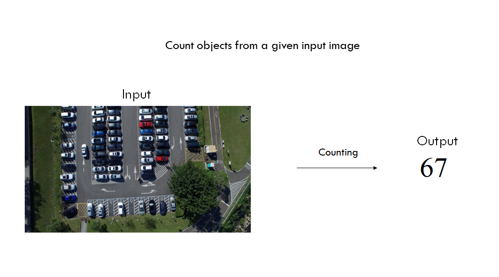
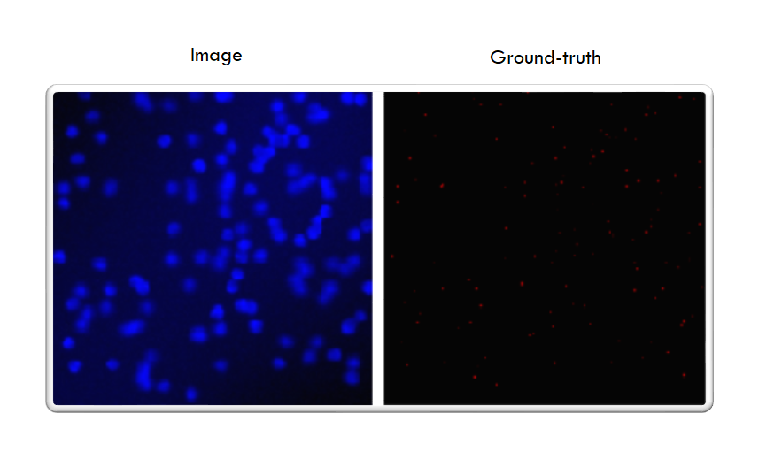
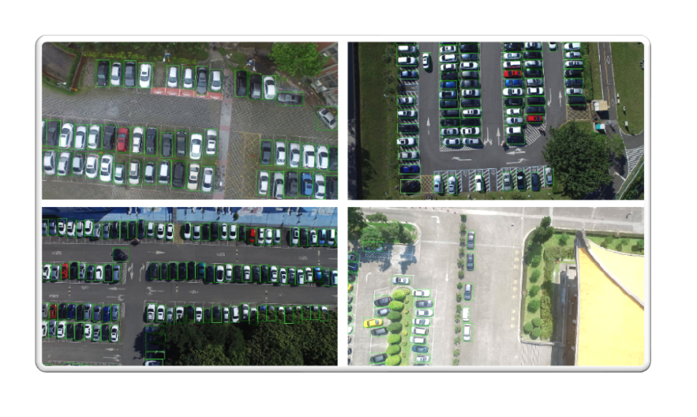
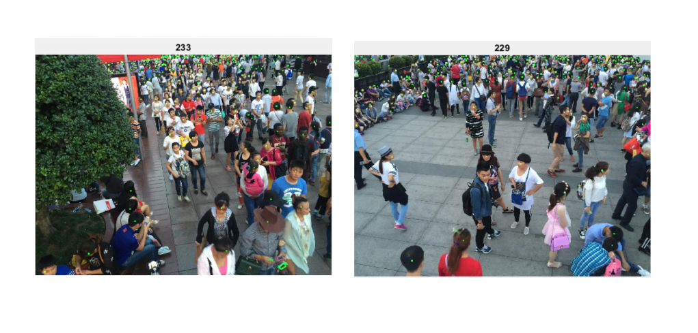
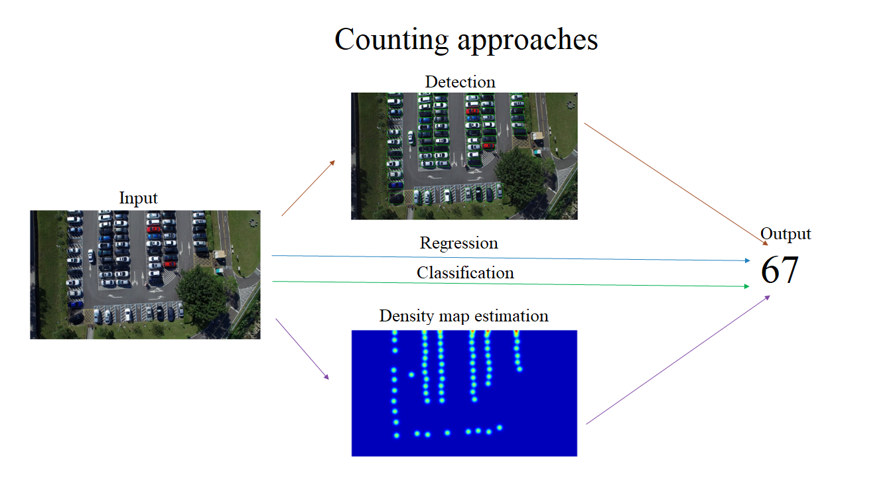
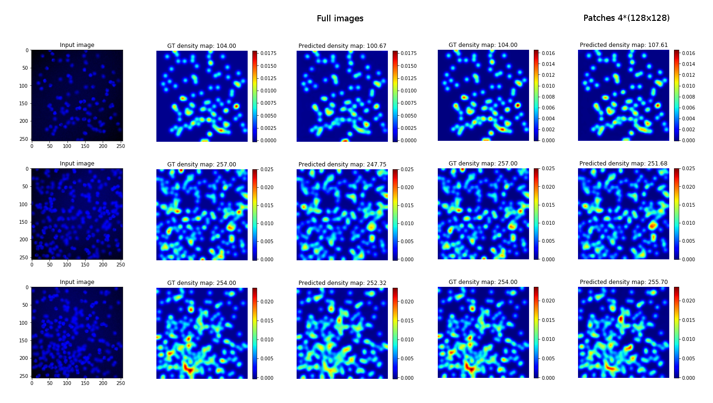
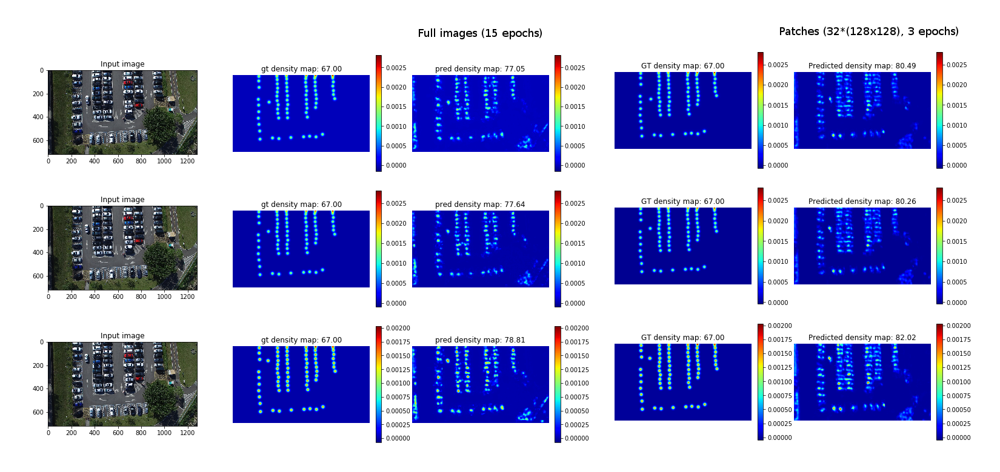
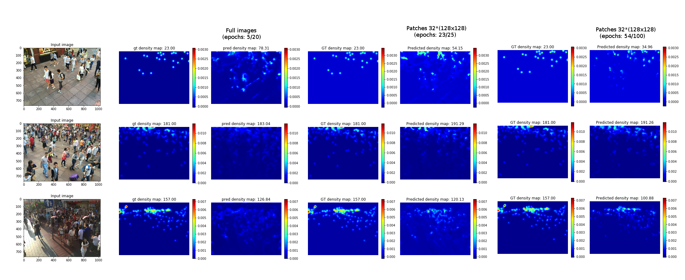

# Object-Counting
Computer Vision Research Project  

## Counting datasets
### VGG Cells
* Synthetic dataset;
* 200 images (256x256) containing simulated bacterial cells from fluorescence-light microscopy;
* Number of cells per image: 174 ± 64;
* Ground-truth: dot annotations.  

### CARPK
* 1,448 images (720x1280) of cars captured from different parking lots;
* 90,000 cars;
* Number of cars in a single scene: [1, 188];
* Ground-truth: bounding boxes.  

### ShanghaiTech (Part B)
* Crowd counting dataset;
* 716 images (768x1024) taken from busy streets;
* Number of people in an image: [9, 539];
* Ground-truth: dot annotations.  

## Counting approaches

## Quantitative results
### VGG Cells
Mean Absolute Error (MAE) and standard deviations for cell counting on VGG Cells dataset.

| Method                                | Details                                   | N = 32    | N = 64    |
| :---                                  | :---                                      | :---:     | :---:     |
| Lempitsky and Zisserman (2010)\[[1]\] | Linear ridge regression                   | 5.9 ± 0.5 | N/A       |
| Lempitsky and Zisserman (2010)\[[1]\] | Density learning                          | 3.5 ± 0.2 | N/A       |
| Fiaschi et al. (2012)\[[2]\]          | Regression forests                        | 3.2 ± 0.1 | N/A       |
| Arteta et al. (2014)\[[3]\]           | Interactive counting                      | 3.5 ± 0.1 | N/A       |
| Xie et al. (2016)\[[4]\]              | FCRN-A                                    | 2.9 ± 0.2 | 2.9 ± 0.2 |
| Xie et al. (2016)\[[4]\]              | FCRN-B                                    | 3.3 ± 0.2 | 3.2 ± 0.2 |
| Cohen et al. (2017) \[[5]\]           | Count-ception                             | 2.4 ± 0.4 | N/A       |
| FCRN-A (our implementation)           | FCRN-A, MSE loss, full images             | 6.0 ± 1.7 | 5.4 ± 1.7 |
| FCRN-A (our implementation)           | FCRN-A, MAE loss, full images             | 8.3 ± 2.7 | 6.6 ± 1.8 |
| FCRN-A (our implementation)           | FCRN-A, LogCosh loss, full images         | 8.3 ± 1.8 | 3.6 ± 0.3 |
| FCRN-A (our implementation)           | FCRN-A, MSE loss, patches 4*(128x128)     | 5.5 ± 0.5 | 3.9 ± 1.1 |
| FCRN-A (our implementation)           | FCRN-A, MAE loss, patches 4*(128x128)     | 6.2 ± 1.8 | 7.4 ± 1.0 |
| FCRN-A (our implementation)           | FCRN-A, LogCosh loss, patches 4*(128x128) | 5.0 ± 1.8 | 4.0 ± 0.9 |

* N - number of train images;
* Our implementation does not include data preprocessing and augmentation;
* Standard deviation corresponds to 5 different draws of training and validation sets;
* Results are presented just for the test set;
* Counts per image: 174 ± 64.

### CARPK
Mean Absolute Error (MAE), Root Mean Squared Error (RMSE), Underestimate (%U), Overestimate (%O) and Difference (%D) on CARPK dataset.  
MAE, RMSE, %U, %O for LPN, GAP and GSP are taken from Aich et al. (2018) \[[8]\].

| Method                      | Details                                                 | MAE   | RMSE  | %U     | %O     |  %D    |
| :---                        | :---                                                    | :---: | :---: | :---:  | :---:  | :---:  | 
| Hsieh et al. (2017) \[[6]\] | LPN                                                     | 13.72 | 21.77 |  N/A   |  N/A   |  N/A   |
| Aich et al. (2018) \[[7]\]  | GAP-224, patches                                        |  7.65 |  9.59 |  6.56% |  0.84% |  7.40% |
| Aich et al. (2018) \[[7]\]  | GAP-Full, full images                                   | 19.61 | 21.65 | 18.71% |  0.24% | 18.95% |
| Aich et al. (2018) \[[8]\]  | GSP-224, patches                                        |  5.46 |  8.09 |  4.14% |  1.14% |  5.28% |
| Aich et al. (2018) \[[8]\]  | GSP-Full, full images                                   | 32.94 | 36.23 | 31.42% |  0.42% | 31.84% |
| FCRN-A (our implementation) | FCRN-A, MSE loss, full images, 15 epochs                | 21.15 | 26.34 | 13.07% |  7.38% | 20.45% |
| FCRN-A (our implementation) | FCRN-A, LogCosh loss, full images, 15 epochs            | 23.34 | 29.65 | 20.41% |  2.15% | 22.56% |
| FCRN-A (our implementation) | FCRN-A, MSE loss, patches 32 * (128x128), 15 epochs     | 22.10 | 28.73 | 18.13% |  3.22% | 21.35% |
| FCRN-A (our implementation) | FCRN-A, MSE loss, patches 32 * (128x128),  3 epochs     | 14.73 | 17.45 |  2.15% | 12.08% | 14.23% |
| FCRN-A (our implementation) | FCRN-A, LogCosh loss, patches 32 * (128x128), 15 epochs | 26.19 | 31.63 | 23.81% |  1.50% | 25.31% | 
| FCRN-A (our implementation) | FCRN-A, LogCosh loss, patches 32 * (128x128),  5 epochs | 12.13 | 15.72 |  5.62% |  6.10% | 11.72% |

### ShanghaiTech (Part B)
Mean Absolute Error (MAE), Root Mean Squared Error (RMSE), Underestimate (%U), Overestimate (%O) and Difference (%D) on ShanghaiTech (Part B) dataset.

| Method                           | Details                                                 | MAE   | RMSE  | %U     | %O     |  %D    |
| :---                             | :---                                                    | :---: | :---: | :---:  | :---:  | :---:  |
| Zhang et al. (2015) \[[9]\]      | Crowd CNN                                               | 32.0  | 49.8  | N/A    | N/A    | N/A    |
| Zhang et al. (2016) \[[10]\]     | MCNN                                                    | 26.4  | 41.3  | N/A    | N/A    | N/A    |
| Sam et al. (2017) \[[11]\]       | Switching CNN                                           | 21.6  | 33.4  | N/A    | N/A    | N/A    |
| Sindagi et al. (2017) \[[12]\]   | CP-CNN                                                  | 20.1  | 30.1  | N/A    | N/A    | N/A    |
| Ranjan et al. (2018) \[[13]\]    | ic-CNN (one stage)                                      | 10.4  | 16.70 | N/A    | N/A    | N/A    |
| Ranjan et al. (2018) \[[13]\]    | ic-CNN (two stages)                                     | 10.7  | 16.00 | N/A    | N/A    | N/A    |
| Olmschenk et al. (2019) \[[14]\] | MUD-i1NN                                                | 14.4  | 20.0  | N/A    | N/A    | N/A    |
| FCRN-A (our implementation)      | FCRN-A, MSE loss, full images, 5/20 epochs              | 52.95 | 74.53 | 19.08% | 23.73% | 42.81% |
| FCRN-A (our implementation)      | FCRN-A, LogCosh loss, full images, 24/30 epochs         | 19.95 | 33.94 | 11.70% |  4.43% | 16.13% |
| FCRN-A (our implementation)      | FCRN-A, MSE loss, patches 32 * (128x128), 54/100 epochs | 21.49 | 34.98 |  9.33% |  8.04% | 17.37% |

## Qualitative results
  
  
  

[1]: https://www.robots.ox.ac.uk/~vgg/publications/2010/Lempitsky10b/lempitsky10b.pdf
[2]: https://www.researchgate.net/publication/261130953_Learning_to_count_with_regression_forest_and_structured_labels
[3]: https://www.robots.ox.ac.uk/~vgg/publications/2014/Arteta14/arteta14.pdf
[4]: http://www.robots.ox.ac.uk/~vgg/publications/2016/Xie16/xie16.pdf
[5]: https://arxiv.org/abs/1703.08710
[6]: https://arxiv.org/abs/1707.05972
[7]: https://arxiv.org/abs/1803.05494
[8]: https://arxiv.org/abs/1805.11123
[9]: http://www.ee.cuhk.edu.hk/~xgwang/papers/zhangLWYcvpr15.pdf
[10]: http://openaccess.thecvf.com/content_cvpr_2016/papers/Zhang_Single-Image_Crowd_Counting_CVPR_2016_paper.pdf
[11]: https://arxiv.org/abs/1708.00199
[12]: https://arxiv.org/abs/1708.00953
[13]: https://arxiv.org/abs/1807.09959
[14]: https://arxiv.org/abs/1902.05379

